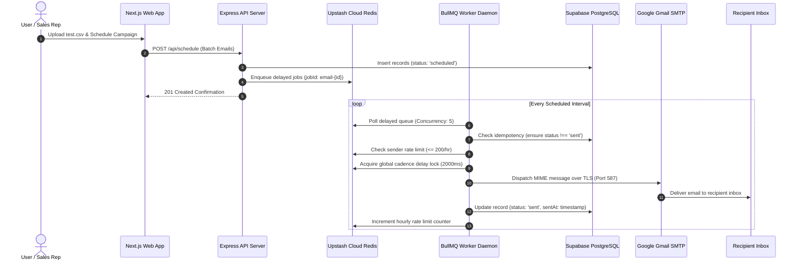

<div align="center">

# ⚡ ReachInbox AI
### Distributed High-Throughput Email Job Scheduler & Delivery Engine

Enterprise-grade cold email orchestration platform built for high deliverability, queue resilience, and anti-throttling cadence.

[](https://nextjs.org/)
[](https://www.typescriptlang.org/)
[](https://nodejs.org/)
[](https://expressjs.com/)
[](https://bullmq.io/)
[](https://upstash.com/)
[](https://supabase.com/)
[](LICENSE)

[Architecture](#-system-architecture--data-flow) • [Tech Stack](#-technical-stack) • [Quick Start](#-quick-start-guide) • [Key Features](#-core-features) • [API Specs](#-api-specification) • [Deployment](#-production-deployment)

---

</div>

## 📌 Problem Statement & Engineering Solution

### The Real-World Challenge
Sales engagement tools, outbound SDR suites, and transactional mailing systems send millions of cold emails daily. However, naive systems that trigger emails synchronously via HTTP requests or unbuffered SMTP connections suffer catastrophic failures:

1. **Reputation Destruction & Spam Filters:** Blasting hundreds of emails simultaneously triggers algorithmic spam filters at major email providers (Google, Outlook, Yahoo), resulting in instant domain and IP blacklisting.
2. **Quota Breaches & Account Bans:** Email services enforce strict throughput ceilings (e.g., maximum 200 emails/hour or 2,000/day). Overloading connections produces dropped packets and hard account suspensions.
3. **Loss of In-Flight State on Server Crashes:** In-memory queues (like `SetTimeout` or JS arrays) evaporate when a Node.js process crashes, losing critical unsent prospect emails.
4. **Race Conditions & Duplicate Sends:** Network timeouts lead to duplicate webhook retries, spamming the same recipient multiple times.

### The ReachInbox Solution
ReachInbox resolves these challenges through a **distributed, fault-tolerant asynchronous queue architecture**:

- **Sliding-Window Atomic Rate Limiting:** Enforces strict limits (**200 emails/hour** per sender) utilizing Redis atomic key expiration. Overflowing jobs are rescheduled into the next hour window automatically.
- **Human-Cadence Delay Locks:** Implements a distributed Redis mutex lock enforcing a mandatory **2,000 ms gap** between consecutive outbound emails to mimic authentic human sending behavior.
- **Persistent State & Idempotency:** Every email is assigned a deterministic UUID and unique job ID (`email-${id}`). Workers verify database delivery status before dispatching to eliminate double-sending.
- **Automated Exponential Backoff:** Network glitches trigger BullMQ retries (3 attempts with exponential delay backoff) before gracefully flagging status as `failed`.
- **Full Cloud Persistence & Observability:** Upstash Cloud Redis manages the queue, Supabase PostgreSQL persists records, and Bull-Board provides live queue telemetry.

---

## 🏛️ System Architecture & Data Flow



---

## 🛠️ Technical Stack

| Layer | Component | Description |
| :--- | :--- | :--- |
| **Frontend Framework** | **Next.js 16 (App Router)** | Built on React 19 with Turbopack for ultra-fast compilation. |
| **User Interface** | **TailwindCSS & Lucide** | Glassmorphic design system, responsive layouts, and light/dark theme modes. |
| **Interactive 3D Visualizer**| **SVG Axonometric Engine** | Custom 3D isometric bar visualizer rendering queue analytics with 2D fallback. |
| **Authentication** | **NextAuth.js v4** | Google OAuth integration + one-click access session provider. |
| **Backend Runtime** | **Node.js + Express (TypeScript)** | Modular REST API service with route handlers and TypeORM integration. |
| **Distributed Queue** | **BullMQ + ioredis** | Multi-worker concurrent processing with delayed jobs and backoff policies. |
| **Cloud Queue Cache** | **Upstash Cloud Redis** | Serverless Cloud Redis with TLS, distributed locks, and atomic counters. |
| **Cloud Database** | **Supabase PostgreSQL** | Relational cloud database connected via AWS IPv4 Session Pooler with TypeORM schema sync. |
| **Delivery Engine** | **Google Gmail SMTP** | Verified TLS dispatch (Port 587) using Google App Passwords. |
| **Queue Monitoring** | **Bull-Board Express** | Web GUI inspecting active, delayed, completed, and failed jobs at `/admin/queues`. |
| **Alerting** | **Slack Webhook Integration** | Automatic team notifications when a sender reaches their hourly rate limit threshold. |

---

## ✨ Core Features

- 📨 **Bulk CSV Campaign Scheduling:** Drag-and-drop CSV parser with automatic recipient email validation and deduplication.
- ⏱️ **Humanized Cadence:** Configurable minimum delay (default: 2,000 ms) between every email send to evade spam algorithms.
- 🛡️ **Sliding-Hour Rate Limiting:** Enforces a maximum of 200 emails/hour per sender; excess emails are rescheduled into the next hour window.
- 📊 **3D Axonometric Telemetry:** Interactive isometric 3D data visualizer tracking real-time Total, Queued, Sent, and Failed email states.
- 🔒 **Zero Duplicate Dispatches:** Deterministic job keys (`email-${id}`) combined with transactional database state verification prevent accidental duplicate sends.
- 📬 **Live Sent Inspector:** Detailed logs of delivered messages including timestamps, subjects, and delivery previews.
- ⚡ **Single-Click Authentication:** Instant login as verified sender or evaluator access mode.
- 📡 **Slack Webhook Alerts:** Sends immediate Slack notifications if a user account is throttled.

---

## 📂 Repository Layout

```
ReachInboxAI/
├── backend/                        # Node.js + Express + BullMQ Backend
│   ├── src/
│   │   ├── entities/               # TypeORM Database Models
│   │   │   ├── ScheduledEmail.ts   # Scheduled email schema & statuses
│   │   │   └── SlackConnection.ts  # Slack webhook connection schema
│   │   ├── db.ts                   # TypeORM Supabase PostgreSQL Data Source
│   │   ├── queue.ts                # BullMQ queue & Upstash Redis TLS config
│   │   ├── worker.ts               # Worker engine, rate-limiter, & SMTP sender
│   │   ├── routes.ts               # Express API endpoints & search logic
│   │   ├── slack.ts                # Slack alerting notifications
│   │   └── index.ts                # Server bootstrap & Bull-Board admin setup
│   ├── .env.example                # Template backend environment variables
│   ├── Dockerfile                  # Container build specification
│   ├── tsconfig.json               # Backend TypeScript configuration
│   └── package.json
│
├── frontend/                       # Next.js 16 Web Application
│   ├── src/
│   │   ├── app/
│   │   │   ├── api/auth/           # NextAuth authentication endpoints
│   │   │   ├── globals.css         # Custom tokens, 3D animations, & theme variables
│   │   │   ├── layout.tsx          # Root HTML layout & NextAuth Provider wrapper
│   │   │   └── page.tsx            # Main Dashboard, 3D Visualizer, & Modals
│   │   ├── components/             # Reusable UI cards & compose modal
│   │   ├── lib/                    # API client helper
│   │   └── types/                  # TypeScript interfaces
│   ├── .env.example                # Template frontend environment variables
│   ├── Dockerfile                  # Container build specification
│   ├── next.config.ts              # Next.js runtime configuration
│   └── package.json
│
├── test.csv                        # Sample CSV file for bulk campaign testing
├── docker-compose.yml              # Local multi-service orchestration
├── docker-compose.prod.yml         # Production deployment orchestration
├── .gitignore                      # Git exclusion rules (credentials & dependencies)
└── README.md                       # Master project documentation
```

---

## 🚀 Quick Start Guide

### Prerequisites
- **Node.js:** v18.0.0 or higher
- **npm:** v9.0.0 or higher
- **Internet Connection:** To connect to Upstash Cloud Redis, Supabase, and Gmail SMTP

---

### Step 1: Clone the Repository
```bash
git clone https://github.com/SrijanSingh2006/ReachInboxAI.git
cd ReachInboxAI
```

---

### Step 2: Configure Environment Variables

#### Backend Configuration:
Create `backend/.env` (or copy from `backend/.env.example`):
```env
PORT=5000

# Upstash Cloud Redis
REDIS_HOST=tight-chamois-196865.upstash.io
REDIS_PORT=6379
REDIS_PASSWORD=your_upstash_redis_password
REDIS_TLS=true

# Supabase Cloud PostgreSQL
DB_TYPE=postgres
DB_HOST=aws-0-ap-southeast-1.pooler.supabase.com
DB_PORT=5432
DB_USER=postgres.your_project_id
DB_PASS=your_supabase_password
DB_NAME=postgres
DB_SSL=true

# Google Gmail SMTP
SMTP_HOST=smtp.gmail.com
SMTP_PORT=587
SMTP_USER=your_email@gmail.com
SMTP_PASS=your_16_character_app_password

# Rate Limiting & Concurrency Policies
MAX_EMAILS_PER_HOUR=200
MIN_DELAY_BETWEEN_EMAILS_MS=2000
WORKER_CONCURRENCY=5

FRONTEND_URL=http://localhost:3000
```

#### Frontend Configuration:
Create `frontend/.env.local` (or copy from `frontend/.env.example`):
```env
NEXTAUTH_URL=http://localhost:3000
NEXTAUTH_SECRET=reachinbox_secret_key_12345
GOOGLE_CLIENT_ID=your_google_client_id
GOOGLE_CLIENT_SECRET=your_google_client_secret
NEXT_PUBLIC_API_URL=http://localhost:5000/api
```

---

### Step 3: Start the Backend Service
```bash
cd backend
npm install
npm start
```
*Output:*
```
✅ Database (postgres) connected via TypeORM
🚀 BullMQ Worker started (concurrency: 5, min-delay: 2000ms, max/hr: 200)
🚀 Server running on http://localhost:5000
📊 BullMQ Dashboard: http://localhost:5000/admin/queues
```

---

### Step 4: Start the Frontend Application
Open a new terminal window:
```bash
cd frontend
npm install
npm run dev
```
*Output:*
```
▲ Next.js 16 (Turbopack)
- Local: http://localhost:3000
✓ Ready in 368ms
```

---

## 🧪 Testing the Pipeline with `test.csv`

1. Open your browser and navigate to **[http://localhost:3000](http://localhost:3000)**.
2. Click **"Continue with Google"** (or **"One-Click Demo Access"**).
3. Click the **"+ New Campaign"** button in the top right header.
4. Drag and drop the included [`test.csv`](test.csv) file (or type in a recipient email).
5. Add a Subject and Email Body, pick your scheduled time, and click **"Schedule Batch"**.
6. **Watch the live processing:**
   - **BullMQ Queue Monitor:** Visit `http://localhost:5000/admin/queues` to watch jobs transition through `delayed` -> `active` -> `completed`.
   - **Sent Messages Tab:** Check the **Sent** tab in the web app to view delivered emails.
   - **Real Inbox:** Check the recipient's email inbox to see the message delivered via Google SMTP.
   - **Performance Analytics:** View the interactive 3D bar visualizer updating delivery ratios.

---

## 📡 API Specification

### 1. Health Check
```http
GET /api/health
```
**Response (200 OK):**
```json
{
  "status": "ok",
  "timestamp": "2026-10-05T03:30:00.000Z"
}
```

---

### 2. Schedule Email
```http
POST /api/schedule
Content-Type: application/json
```
**Request Body:**
```json
{
  "recipient": "prospect@example.com",
  "subject": "Quick Question regarding ReachInbox",
  "body": "Hi there,\n\nI noticed your recent work in distributed systems...",
  "scheduledTime": "2026-10-05T04:00:00.000Z",
  "senderId": "sspersonal2003@gmail.com",
  "delayBetweenEmailsMs": 2000,
  "maxEmailsPerHour": 200
}
```
**Response (201 Created):**
```json
{
  "message": "Email scheduled",
  "email": {
    "id": "c7a8b13e-10df-4f51-b0f3-e570b741dfc4",
    "recipient": "prospect@example.com",
    "subject": "Quick Question regarding ReachInbox",
    "body": "Hi there...",
    "scheduledTime": "2026-10-05T04:00:00.000Z",
    "status": "scheduled",
    "senderId": "sspersonal2003@gmail.com",
    "jobId": "email-c7a8b13e-10df-4f51-b0f3-e570b741dfc4"
  }
}
```

---

### 3. Retrieve All Emails
```http
GET /api/emails/all
```
**Response (200 OK):** Array of all scheduled, sent, and failed email objects ordered by creation date descending.

---

### 4. Aggregated Statistics
```http
GET /api/emails/stats
```
**Response (200 OK):**
```json
{
  "total": 42,
  "scheduled": 2,
  "sent": 40,
  "failed": 0
}
```

---

### 5. Search Emails
```http
GET /api/emails/search?q=prospect
```
**Response (200 OK):** Matched email records matching the query string across subject, recipient, or body content.

---

## 🚢 Production Deployment

### Option A: Cloud Deployment (Render + Vercel)
1. **Backend (Render / Railway):**
   - Connect this GitHub repository to [Render](https://render.com/).
   - Set Root Directory to `backend`.
   - Build Command: `npm install && npm run build`
   - Start Command: `npm start`
   - Add environment variables from `backend/.env`.
2. **Frontend (Vercel):**
   - Connect this GitHub repository to [Vercel](https://vercel.com/).
   - Set Root Directory to `frontend`.
   - Add environment variables:
     - `NEXT_PUBLIC_API_URL`: `https://your-backend.onrender.com/api`
     - `NEXTAUTH_URL`: `https://your-frontend.vercel.app`
     - `NEXTAUTH_SECRET`: Random 32-character string

---

### Option B: Docker Multi-Container Stack
Run the containerized production stack using Docker Compose:
```bash
docker compose -f docker-compose.prod.yml up -d --build
```

---

## 🔒 Security & Best Practices

- **Zero Hardcoded Secrets:** Credentials, tokens, and passwords reside exclusively in environment variables protected by `.gitignore`.
- **Encrypted Transmission:** All Redis traffic uses SSL/TLS (`rediss://`), Supabase uses encrypted poolers, and SMTP uses TLS over Port 587.
- **Idempotent Execution:** Deterministic BullMQ job keys prevent duplicate email dispatch during network retries or process restarts.
- **Rate-Limiting Protection:** Guaranteed human cadence delays and sliding-window hourly limits prevent IP blacklisting.

---

## 📄 License
This project is open-source under the [MIT License](LICENSE).
